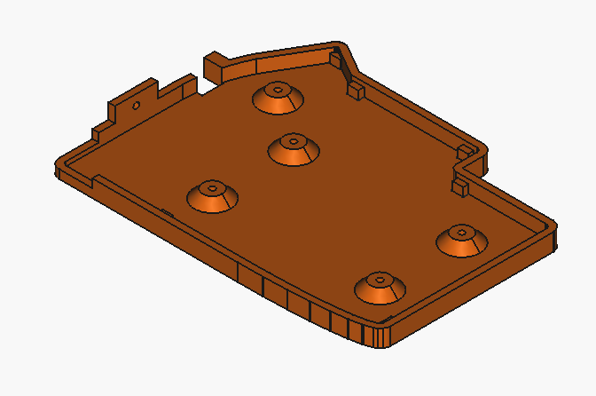
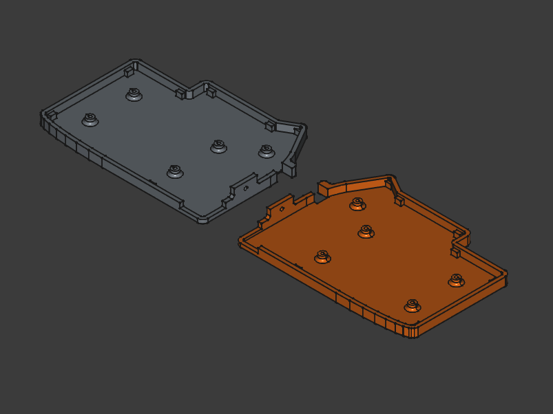
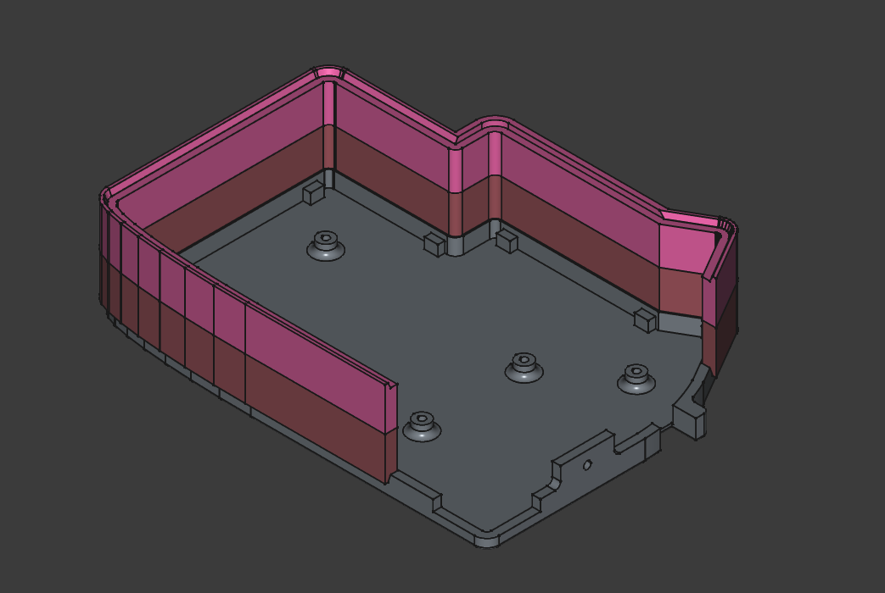

# LILY58PRO Slim Case with 18650 Battery Slot Mounting

# Overview
	Done in Freecad.

# Logs
	31 August 2025 - designed case with tighter tolerance as well as added side ledges to prevent PCB from flexing. Designed a two part filler for the sides of the keyboards to allow a clean stack.

	10 April 2025 - Printed and fitted. Looks good. Need to add 5th mounting hole. lessen mounting standoffs to 4mm. tenting fail need to align instead.

# Design

