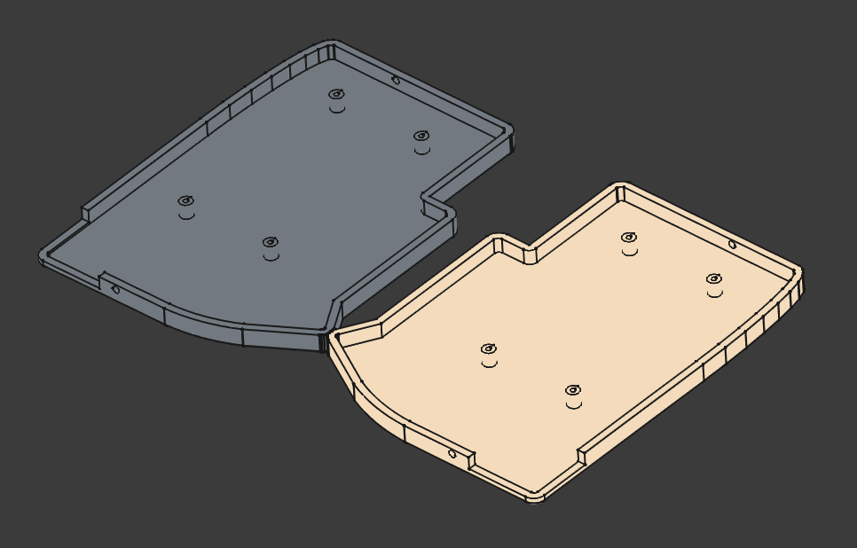
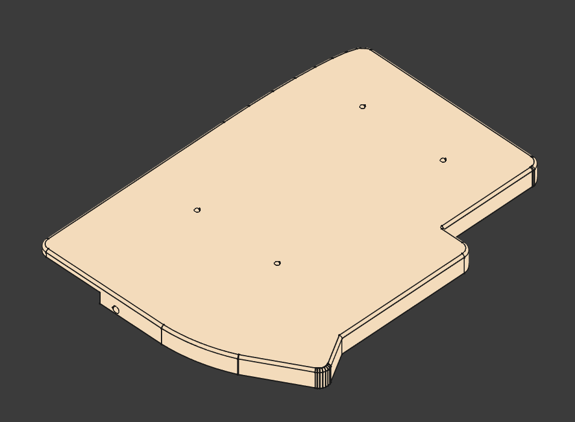

# LILY58PRO Slim Case with 18650 Battery Slot Mounting

# Overview
	Done in Freecad.

# Logs
	10 April 2025 - Printed and fitted. Looks good. Need to add 5th mounting hole. lessen mounting standoffs to 4mm. tenting fail need to align instead.

# Design

